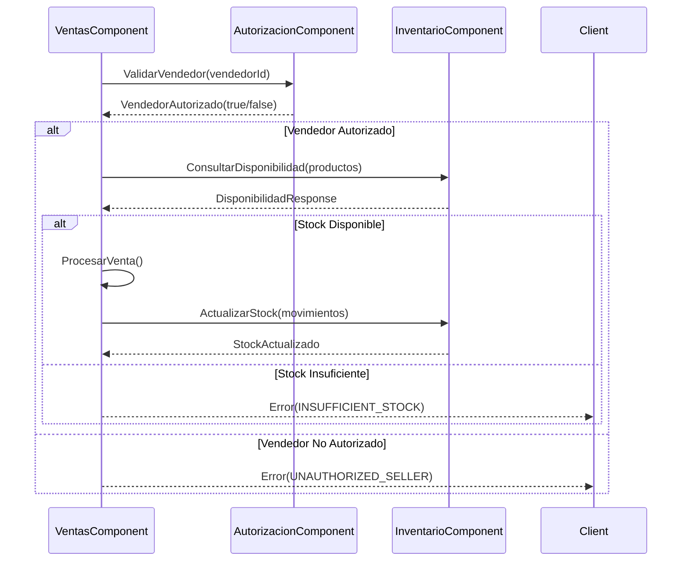
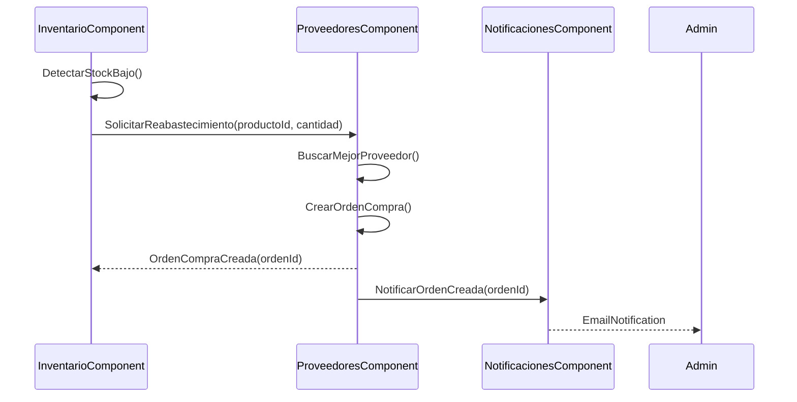

# Protocolos de Interacción entre Componentes - PoliMarket CBSE

## 1. Arquitectura de Comunicación

### Patrones de Comunicación Implementados

```
┌─────────────────┐    ┌─────────────────┐    ┌─────────────────┐
│   Componente A  │    │  Message Bus    │    │   Componente B  │
│                 │───▶│                 │◀───│                 │
│  - Request      │    │ - Routing       │    │  - Response     │
│  - Timeout      │    │ - Transform     │    │  - Processing   │
│  - Retry        │    │ - Monitor       │    │  - Error Handle │
└─────────────────┘    └─────────────────┘    └─────────────────┘
```

### Tipos de Comunicación

1. **Síncrona**: Request-Response inmediato
2. **Asíncrona**: Message Queue con procesamiento diferido
3. **Event-Driven**: Publicación/Suscripción de eventos
4. **Streaming**: Flujo continuo de datos

## 2. Protocolos por Tipo de Interacción

### 2.1 Comunicación Síncrona (HTTP/REST)

#### Configuración de Timeouts

```yaml
timeout_configuration:
  components:
    autorizacion:
      connection_timeout: 5s
      read_timeout: 10s
      write_timeout: 5s
    ventas:
      connection_timeout: 3s
      read_timeout: 15s
      write_timeout: 10s
    inventario:
      connection_timeout: 2s
      read_timeout: 8s
      write_timeout: 5s
```

#### Formato de Mensaje Estándar

```json
{
  "header": {
    "messageId": "msg_123456789",
    "timestamp": "2025-01-15T10:30:00Z",
    "source": "VentasComponent",
    "target": "InventarioComponent",
    "version": "1.0.0",
    "correlationId": "corr_987654321"
  },
  "payload": {
    "operation": "consultarDisponibilidad",
    "data": {
      "productoId": "prod_001",
      "cantidad": 10
    }
  },
  "metadata": {
    "priority": "high",
    "retryCount": 0,
    "maxRetries": 3
  }
}
```

#### Política de Reintentos

```csharp
public class RetryPolicy
{
    public static readonly RetryPolicy Default = new RetryPolicy
    {
        MaxRetries = 3,
        BaseDelay = TimeSpan.FromSeconds(1),
        MaxDelay = TimeSpan.FromSeconds(30),
        BackoffMultiplier = 2.0,
        Jitter = true
    };

    public static readonly RetryPolicy Critical = new RetryPolicy
    {
        MaxRetries = 5,
        BaseDelay = TimeSpan.FromMilliseconds(500),
        MaxDelay = TimeSpan.FromSeconds(60),
        BackoffMultiplier = 1.5,
        Jitter = true
    };
}
```

### 2.2 Comunicación Asíncrona (Message Queue)

#### Configuración de Colas

```yaml
message_queues:
  ventas_processing:
    type: "persistent"
    max_size: 10000
    ttl: 3600s
    dead_letter_queue: "ventas_dlq"
    
  inventory_updates:
    type: "durable"
    max_size: 5000
    ttl: 1800s
    batch_size: 100
    
  notifications:
    type: "transient"
    max_size: 50000
    ttl: 300s
    priority_levels: 3
```

#### Formato de Evento

```json
{
  "eventId": "evt_123456789",
  "eventType": "VentaProcesada",
  "version": "1.0",
  "timestamp": "2025-01-15T10:30:00Z",
  "source": "VentasComponent",
  "data": {
    "ventaId": "venta_001",
    "clienteId": "cliente_123",
    "total": 1500.00,
    "productos": [
      {
        "productoId": "prod_001",
        "cantidad": 2,
        "precio": 750.00
      }
    ]
  },
  "metadata": {
    "causationId": "cmd_987654321",
    "correlationId": "corr_555666777"
  }
}
```

## 3. Manejo de Errores y Excepciones

### 3.1 Clasificación de Errores

| Tipo | Código | Acción | Retry | Ejemplo |
|------|--------|--------|-------|---------|
| **Transient** | 5xx, timeout | Retry automático | Sí | Network timeout |
| **Business** | 4xx | Log y notificar | No | Stock insuficiente |
| **System** | 500 | Escalate | Condicional | Database down |
| **Security** | 401, 403 | Block y audit | No | Token inválido |

### 3.2 Circuit Breaker Pattern

```csharp
public class CircuitBreakerConfig
{
    public int FailureThreshold { get; set; } = 5;
    public TimeSpan OpenTimeout { get; set; } = TimeSpan.FromMinutes(1);
    public TimeSpan HalfOpenTimeout { get; set; } = TimeSpan.FromSeconds(30);
    public int SuccessThreshold { get; set; } = 3;
}

public enum CircuitBreakerState
{
    Closed,    // Normal operation
    Open,      // Failing fast
    HalfOpen   // Testing recovery
}
```

### 3.3 Estrategias de Fallback

```yaml
fallback_strategies:
  autorizacion:
    strategy: "cache_local"
    cache_ttl: 300s
    fallback_response: "allow_with_audit"
    
  inventario:
    strategy: "read_only_mode"
    cached_data_ttl: 600s
    fallback_response: "last_known_state"
    
  ventas:
    strategy: "queue_for_later"
    queue_name: "pending_sales"
    max_queue_time: 3600s
```

## 4. Protocolos Específicos por Componente

### 4.1 AutorizacionComponent ↔ VentasComponent

#### Flujo de Autorización de Venta



#### Configuración de Protocolo

```json
{
  "protocol": "sync_http",
  "endpoint": "/api/autorizacion/validar-vendedor",
  "method": "POST",
  "timeout": 5000,
  "retries": 2,
  "circuit_breaker": {
    "enabled": true,
    "failure_threshold": 3,
    "recovery_timeout": 30000
  }
}
```

### 4.2 InventarioComponent ↔ ProveedoresComponent

#### Flujo de Reabastecimiento Automático



#### Configuración de Protocolo

```json
{
  "protocol": "async_message",
  "queue": "inventory_restocking",
  "exchange": "inventory_events",
  "routing_key": "stock.low",
  "message_ttl": 3600000,
  "retry_policy": {
    "max_retries": 5,
    "backoff_multiplier": 2,
    "initial_delay": 1000
  }
}
```

## 5. Monitoreo y Observabilidad

### 5.1 Métricas de Comunicación

```yaml
metrics:
  request_duration:
    type: histogram
    buckets: [0.1, 0.5, 1.0, 2.5, 5.0, 10.0]
    labels: [source_component, target_component, operation]
    
  request_rate:
    type: counter
    labels: [source_component, target_component, status_code]
    
  circuit_breaker_state:
    type: gauge
    labels: [component, target]
    
  queue_depth:
    type: gauge
    labels: [queue_name, component]
```

### 5.2 Logging Estructurado

```json
{
  "timestamp": "2025-01-15T10:30:00.123Z",
  "level": "INFO",
  "component": "VentasComponent",
  "operation": "procesarVenta",
  "correlationId": "corr_123456",
  "message": "Venta procesada exitosamente",
  "data": {
    "ventaId": "venta_001",
    "duration": 1250,
    "componentsInvolved": ["AutorizacionComponent", "InventarioComponent"]
  }
}
```

### 5.3 Distributed Tracing

```csharp
public class TracingMiddleware
{
    public async Task InvokeAsync(HttpContext context, RequestDelegate next)
    {
        using var activity = ActivitySource.StartActivity("component_interaction");
        activity?.SetTag("component.source", GetSourceComponent());
        activity?.SetTag("component.target", GetTargetComponent());
        activity?.SetTag("operation", GetOperation(context));
        
        try
        {
            await next(context);
            activity?.SetStatus(ActivityStatusCode.Ok);
        }
        catch (Exception ex)
        {
            activity?.SetStatus(ActivityStatusCode.Error, ex.Message);
            throw;
        }
    }
}
```

## 6. Configuración de Seguridad

### 6.1 Autenticación entre Componentes

```yaml
security:
  inter_component_auth:
    method: "mutual_tls"
    certificate_path: "/certs/component.crt"
    private_key_path: "/certs/component.key"
    ca_certificate_path: "/certs/ca.crt"
    
  api_keys:
    enabled: true
    rotation_period: "30d"
    key_length: 256
    
  jwt_tokens:
    issuer: "PoliMarket.IntegracionComponent"
    audience: "PoliMarket.Components"
    expiration: "1h"
    algorithm: "RS256"
```

### 6.2 Autorización de Operaciones

```json
{
  "authorization_matrix": {
    "VentasComponent": {
      "can_call": [
        "AutorizacionComponent.validarVendedor",
        "InventarioComponent.consultarDisponibilidad",
        "ClientesComponent.obtenerDatos"
      ]
    },
    "InventarioComponent": {
      "can_call": [
        "ProveedoresComponent.solicitarReabastecimiento",
        "NotificacionesComponent.enviarAlerta"
      ]
    }
  }
}
```

## 7. Testing de Protocolos

### 7.1 Contract Testing

```csharp
[Test]
public async Task VentasComponent_Should_CallAutorizacion_WithCorrectFormat()
{
    // Arrange
    var mockAutorizacion = new Mock<IAutorizacion>();
    var ventasService = new VentasService(mockAutorizacion.Object);
    
    // Act
    await ventasService.ProcesarVentaAsync(ventaDto);
    
    // Assert
    mockAutorizacion.Verify(x => x.ValidarVendedorAsync(
        It.Is<string>(id => !string.IsNullOrEmpty(id))), 
        Times.Once);
}
```

### 7.2 Integration Testing

```csharp
[Test]
public async Task Integration_VentasFlow_Should_CompleteSuccessfully()
{
    // Arrange
    using var factory = new WebApplicationFactory<Program>();
    var client = factory.CreateClient();
    
    // Act
    var response = await client.PostAsync("/api/ventas", ventaContent);
    
    // Assert
    response.StatusCode.Should().Be(HttpStatusCode.Created);
    
    // Verify side effects
    var inventoryUpdated = await VerifyInventoryUpdated();
    inventoryUpdated.Should().BeTrue();
}
```

## Conclusiones

Los protocolos de interacción definidos garantizan:

1. **Comunicación Confiable**: Timeouts, reintentos y circuit breakers
2. **Observabilidad Completa**: Métricas, logs y tracing distribuido
3. **Seguridad Robusta**: Autenticación mutua y autorización granular
4. **Resilencia**: Estrategias de fallback y recuperación automática
5. **Testabilidad**: Contract testing e integration testing

Estos protocolos deben ser implementados consistentemente en todos los componentes para garantizar la interoperabilidad y confiabilidad del sistema PoliMarket.
